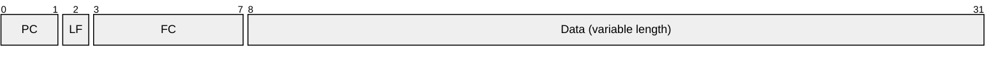
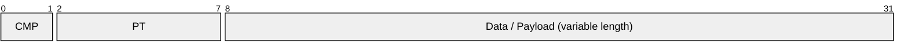
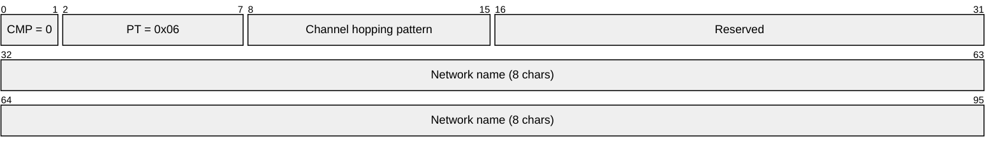
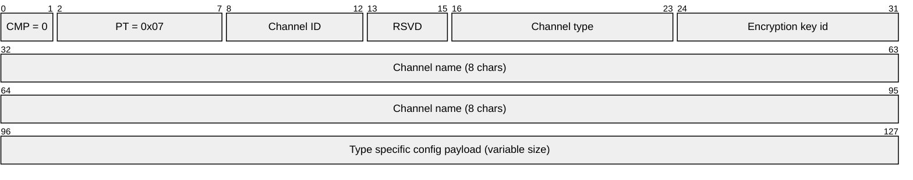
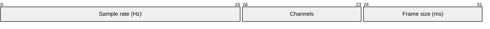
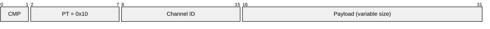

# PulsBlitz
Single-Sender, Multi-Receiver, Non-Mesh Realtime Radio Protocol

The name is a reference to the German term "Potzblitz"

## Motivation
I wanted to have a open protocol that suits realtime-control data really well but also has some features some other protocols do not support:
* Be agnostic of the underlying radio hardware or libraries
* Allow multi-receiver operation (RC-control protocols for model cars, boats, planes, multicopter) are usually single-RX only

## Features
* Single-Transmitter protocol. One node in the network is the primary transmitter, controlling the network and sending/broadcasting most of the data
* Controller sends all data as broadcasts, the receivers need to decide if the data in question is relevant for them or not
* Nodes have a pseudo-unique, 16 byte long ID. It's UUID-style but can be true random, derived from the unique SPI-flash identifier or configured by the user
* There is a discovery mechanism in place so that the controller can query associated receivers
* Channel Hopping is planned but not yet implemented. If channel hopping, Master sends rendevouz-packet on rendevouz-channel, containing hopping pattern and offset
* Packets can be fragmented so we support low-payload-size lower-levels (looking at you, nRF24 ...), max 32 fragments per packet (5 bit plus 1 bit "last fragment" plus 2 bit packet counter). Of course, larger fragments on the lower level result in reduced overhead and better latency
* Packets are NOT acknowledged, do expect packet loss. It's a realtime control-value protocol, not for reliable data transfer. It's more UDP than TCP
* Each transmitter can send up to 64 different payload channels. One channel can contain things like one DMX universe, one opus audio stream, one set of flight-control-values, one location information, one file-transfer-session, ...
* The transmitter sends "payload channel description" packets regularly, describing data type, name, status of one payload channel
* The protocol thinks in time-slots. Their exact length depends on the underlying radio hardware and configuration (payload length, data rate, ...)
* The transmitter can announce that the up-coming time slot is to be used by a certain, announced receiver. This way, a small back-channels exists for values such as battery level, packet loss rate, sensor values, ... However, this does not make it a multi-directional or multi-sender realtime protocol
* Encryption is optional and can be configured per payload channel
* Snappy compression is required to be implemented on all nodes. The size savings might not be huge but calculation complexity and increase in latency is usually so low that it's worth it. However, the usage of compression can vary from packet to packet. The transmitter decides if compression makes sense for that packet or not
* The protocol is not really meant for rate-limited sending. It might work in case no realtime-data is sent and nodes are just discovered and queried but for most applications, use a frequency band with no duty-cycle limitations

## Packet layout

### Lower Layer - Defragmentation

Each fragment features a `counter` field that simply contains information about how to de-fragment the content:
| Abbreviation | Description |
| --- | --- |
| PC | Packet Counter (Wraps after 4 packets) |
| LF | Last fragment. 1 = This is the last fragment, 0 = More fragments follow |
| FC | Fragment counter (0 to 31) |

### Middle Layer - Network Management and Payload Description

Each packet contains one bit to declare the following payload as compressed plus 7 bit declaring the `packet type`. This value also defines how the rest of the payload is layed out

#### 0x00: NOOP
Can be sent by the transmitter or an addressed receiver to devote that there is currently no data but the node is still alive. No payload.

#### 0x01: Disovery - UnMute ALL
Sent by the transmitter to UnMute ALL receviers so that they will respond to discovery requests. No Payload

#### 0x02: Disovery - Mute
Sent by the transmitter to an addressed receiver to make it no longer respond to discovery requests. Payload is the addressed receivers ID (16 byte).

#### 0x03: Disovery - Request
Sent by the transmitter to discover associated receivers. Payload is the range of receivers addressed (FROM -> TO, 2x 16 byte).
The following time slot can be used by any node.

#### 0x04: Disovery - Response
Sent by a receiver as a response to 0x03. Payload MUST NOT BE COMPRESSED and contains the receivers ID.

TODO: Check if we can reliably distinguish NO RESPONSE from COLLISSION this way!

#### 0x05: Management - Next slot is for RX
Will be sent by the transmitter to declare the next time slot for use by receiver with id given as payload (16 byte).

#### 0x06: Management - Rendezvous
Will be sent by the transmitter to declare network name and hopping pattern:

#### 0x07: Management - Payload Channel description
Will be sent by transmitter repeatedly, once for each payload channel in use:

Defined channel types:

###### 0x00: DMX512 data
Config data:

###### 0x10: Opus Audio Data
Config data:

#### 0x10: Payload Channel Payload
Will be sent by transmitter whenver true payload needs to be sent

## Channel hopping
Channel hopping is done after every fragment. The initial / rendesvouz channel will always be used by the transmitter for the rendesvouz packet. The transmitter needs to make sure that this time slot is not given to any receiver.

The channel hopping always consists of 64 channels. In the 2.4 GHz band, there should be (at least) 100 usable channels (depending on region, it could be more). The hopping sequence is given as one byte. a value of 0 means no hopping = constant channel. Otherwise, we calculate the SHA512 hash of the single-byte input, which results in 64 one-byte values. The nth channel (1-63, since 0 = rendesvouz = fixed and known) is caclulated as: `(rendesvouz-channel) + (nth value of the SHA512 hash) MODULO 100`. Of course, one does not need to actually implement the SHA512 calculation. A look-up-table for the 254 possible values would also be fine but takes up around 16kByte of memory.

